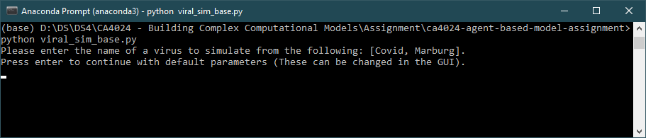

# CA4024 - Agent Based Model Assignment

This repo contains the code for and results from the agent based model we have created
to model the spread of a disease through a population.

## Running the model

The model can be run from the commandline by calling *python viral_sim_base.py*.

The user is prompted to enter the name of a virus to simulate, which pulls the values
from the parameters saved in the script. If no virus is entered then the default
values are used in the simulation.

Once the simulation has started, the parameter values can be changed within the GUI
in the parameter tab. Once these values are changed the simulation can be reset
and ran from the start.

The output generated is saved into a new subdirectory in the Simulations
directory. The output consists of the Plots/agents directory that contains the saved
images of the simulation environment that are used to generate a GIF of the simulation.

## Table of Contents

+ [Project Report](CA4024_ABM_Assignment_Report.pdf) - PDF report for this assignment.
+ [Viral Simulation Script](viral_sim_base.py) - Main script containing the simulation code.
+ [Visualisation Notebook](results_vis.ipynb) - Jupyter Notebook that contains the code used to generate the visualisations.
+ [GIF Creation Script](gif_creation.py) - Script used to generate the GIFs of the simulations
+ [Images](images/) - Directory containing the images used in the report and README.md file.
+ [Simulations](Simulations/) - Directory that contains the results from simulations runs.
  + [Covid Simulation Results](Simulations/covid_2023-04-23-18-45-35/) - Results of the Covid simulation run.
    + [Covid Simulation GIF Vaccination 0.0](Simulations/covid_2023-04-23-18-45-35/vac_rate_0/sim.gif) - GIF of Covid simulation with vaccination rate 0.0.
    + [Covid Simulation GIF Vaccination 0.1](Simulations/covid_2023-04-23-18-45-35/vac_rate_0.1/sim.gif) - GIF of Covid simulation with vaccination rate 0.1.
    + [Covid Simulation GIF Vaccination 0.2](Simulations/covid_2023-04-23-18-45-35/vac_rate_0.2/sim.gif) - GIF of Covid simulation with vaccination rate 0.2.
    + [Covid Simulation GIF Vaccination 0.3](Simulations/covid_2023-04-23-18-45-35/vac_rate_0.3/sim.gif) - GIF of Covid simulation with vaccination rate 0.3.
    + [Covid Simulation GIF Vaccination 0.4](Simulations/covid_2023-04-23-18-45-35/vac_rate_0.4/sim.gif) - GIF of Covid simulation with vaccination rate 0.4.
    + [Covid Simulation GIF Vaccination 0.5](Simulations/covid_2023-04-23-18-45-35/vac_rate_0.5/sim.gif) - GIF of Covid simulation with vaccination rate 0.5.
    + [Covid Simulation GIF Vaccination 0.6](Simulations/covid_2023-04-23-18-45-35/vac_rate_0.6/sim.gif) - GIF of Covid simulation with vaccination rate 0.6.
    + [Covid Simulation GIF Vaccination 0.7](Simulations/covid_2023-04-23-18-45-35/vac_rate_0.7/sim.gif) - GIF of Covid simulation with vaccination rate 0.7.
    + [Covid Simulation GIF Vaccination 0.8](Simulations/covid_2023-04-23-18-45-35/vac_rate_0.8/sim.gif) - GIF of Covid simulation with vaccination rate 0.8.
    + [Covid Simulation GIF Vaccination 0.9](Simulations/covid_2023-04-23-18-45-35/vac_rate_0.9/sim.gif) - GIF of Covid simulation with vaccination rate 0.9.
    + [Covid Simulation GIF Vaccination 1.0](Simulations/covid_2023-04-23-18-45-35/vac_rate_1.0/sim.gif) - GIF of Covid simulation with vaccination rate 1.0.
  + [Marburg Simulation Results (Dynamic Death Rate)](Simulations/marburg_dynamic_death_rate/) - Results of the Marburg simulation (Dynamic Death Rate) run.
    + [Marburg Simulation (Dynamic Death Rate) GIF Vaccination 0.0](Simulations/marburg_dynamic_death_rate/vac_rate_0/sim.gif) - GIF of Marburg simulation (Dynamic Death Rate) with vaccination rate 0.0.
    + [Marburg Simulation (Dynamic Death Rate) GIF Vaccination 0.1](Simulations/marburg_dynamic_death_rate/vac_rate_0.1/sim.gif) - GIF of Marburg simulation (Dynamic Death Rate) with vaccination rate 0.1.
    + [Marburg Simulation (Dynamic Death Rate) GIF Vaccination 0.2](Simulations/marburg_dynamic_death_rate/vac_rate_0.2/sim.gif) - GIF of Marburg simulation (Dynamic Death Rate) with vaccination rate 0.2.
    + [Marburg Simulation (Dynamic Death Rate) GIF Vaccination 0.3](Simulations/marburg_dynamic_death_rate/vac_rate_0.3/sim.gif) - GIF of Marburg simulation (Dynamic Death Rate) with vaccination rate 0.3.
    + [Marburg Simulation (Dynamic Death Rate) GIF Vaccination 0.4](Simulations/marburg_dynamic_death_rate/vac_rate_0.4/sim.gif) - GIF of Marburg simulation (Dynamic Death Rate) with vaccination rate 0.4.
    + [Marburg Simulation (Dynamic Death Rate) GIF Vaccination 0.5](Simulations/marburg_dynamic_death_rate/vac_rate_0.5/sim.gif) - GIF of Marburg simulation (Dynamic Death Rate) with vaccination rate 0.5.
    + [Marburg Simulation (Dynamic Death Rate) GIF Vaccination 0.6](Simulations/marburg_dynamic_death_rate/vac_rate_0.6/sim.gif) - GIF of Marburg simulation (Dynamic Death Rate) with vaccination rate 0.6.
    + [Marburg Simulation (Dynamic Death Rate) GIF Vaccination 0.7](Simulations/marburg_dynamic_death_rate/vac_rate_0.7/sim.gif) - GIF of Marburg simulation (Dynamic Death Rate) with vaccination rate 0.7.
    + [Marburg Simulation (Dynamic Death Rate) GIF Vaccination 0.8](Simulations/marburg_dynamic_death_rate/vac_rate_0.8/sim.gif) - GIF of Marburg simulation (Dynamic Death Rate) with vaccination rate 0.8.
    + [Marburg Simulation (Dynamic Death Rate) GIF Vaccination 0.9](Simulations/marburg_dynamic_death_rate/vac_rate_0.9/sim.gif) - GIF of Marburg simulation (Dynamic Death Rate) with vaccination rate 0.9.
    + [Marburg Simulation (Dynamic Death Rate) GIF Vaccination 1.0](Simulations/marburg_dynamic_death_rate/vac_rate_1.0/sim.gif) - GIF of Marburg simulation (Dynamic Death Rate) with vaccination rate 1.0.
  + [Marburg Simulation Results (Static Death Rate)](Simulations/marburg_static_death_rate/) - Results of the Marburg simulation (Static Death Rate) run.
    + [Marburg Simulation (Static Death Rate) GIF Vaccination 0.0](Simulations/marburg_static_death_rate/vac_rate_0/sim.gif) - GIF of Marburg simulation (Static Death Rate) with vaccination rate 0.0.
    + [Marburg Simulation (Static Death Rate) GIF Vaccination 0.1](Simulations/marburg_static_death_rate/vac_rate_0.1/sim.gif) - GIF of Marburg simulation (Static Death Rate) with vaccination rate 0.1.
    + [Marburg Simulation (Static Death Rate) GIF Vaccination 0.2](Simulations/marburg_static_death_rate/vac_rate_0.2/sim.gif) - GIF of Marburg simulation (Static Death Rate) with vaccination rate 0.2.
    + [Marburg Simulation (Static Death Rate) GIF Vaccination 0.3](Simulations/marburg_static_death_rate/vac_rate_0.3/sim.gif) - GIF of Marburg simulation (Static Death Rate) with vaccination rate 0.3.
    + [Marburg Simulation (Static Death Rate) GIF Vaccination 0.4](Simulations/marburg_static_death_rate/vac_rate_0.4/sim.gif) - GIF of Marburg simulation (Static Death Rate) with vaccination rate 0.4.
    + [Marburg Simulation (Static Death Rate) GIF Vaccination 0.5](Simulations/marburg_static_death_rate/vac_rate_0.5/sim.gif) - GIF of Marburg simulation (Static Death Rate) with vaccination rate 0.5.
    + [Marburg Simulation (Static Death Rate) GIF Vaccination 0.6](Simulations/marburg_static_death_rate/vac_rate_0.6/sim.gif) - GIF of Marburg simulation (Static Death Rate) with vaccination rate 0.6.
    + [Marburg Simulation (Static Death Rate) GIF Vaccination 0.7](Simulations/marburg_static_death_rate/vac_rate_0.7/sim.gif) - GIF of Marburg simulation (Static Death Rate) with vaccination rate 0.7.
    + [Marburg Simulation (Static Death Rate) GIF Vaccination 0.8](Simulations/marburg_static_death_rate/vac_rate_0.8/sim.gif) - GIF of Marburg simulation (Static Death Rate) with vaccination rate 0.8.
    + [Marburg Simulation (Static Death Rate) GIF Vaccination 0.9](Simulations/marburg_static_death_rate/vac_rate_0.9/sim.gif) - GIF of Marburg simulation (Static Death Rate) with vaccination rate 0.9.
    + [Marburg Simulation (Static Death Rate) GIF Vaccination 1.0](Simulations/marburg_static_death_rate/vac_rate_1.0/sim.gif) - GIF of Marburg simulation (Static Death Rate) with vaccination rate 1.0.

